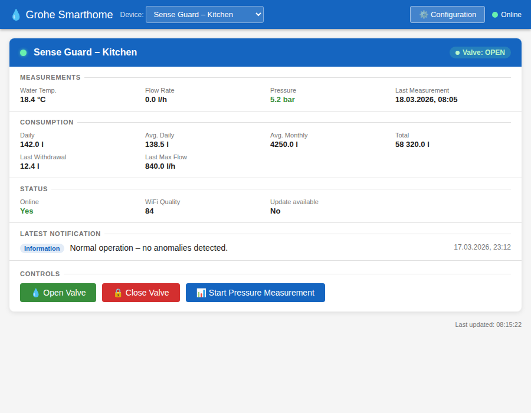
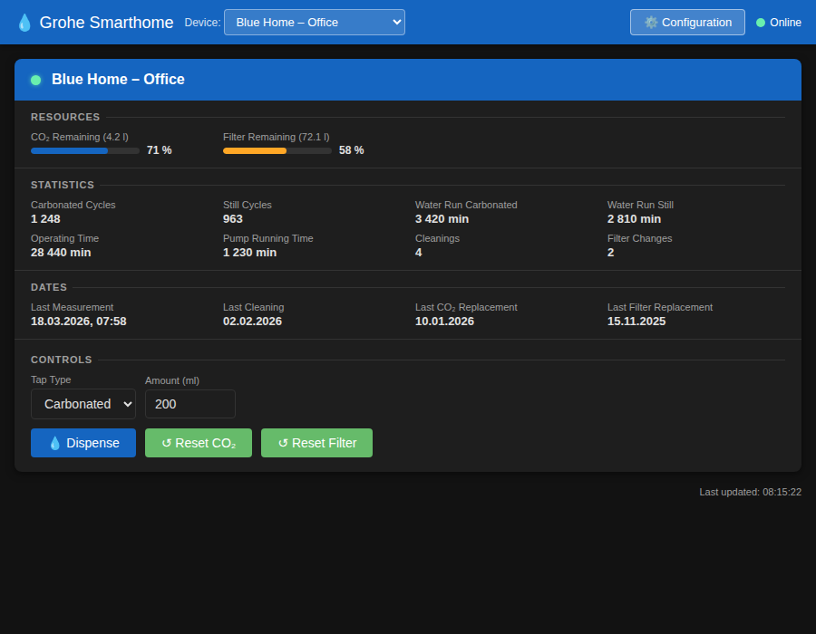

# ioBroker Grohe Smarthome Adapter

Dieser Adapter verbindet ioBroker mit der **Grohe Smarthome / Ondus**-Cloud und stellt Grohe-Geräte als Zustände (und einige Steuerungen) in ioBroker zur Verfügung.

Unterstützt werden:

- **Grohe Sense** (Typ `101`)
- **Grohe Sense Guard** (Typ `103`)
- **Grohe Blue Home** (Typ `104`)
- **Grohe Blue Professional** (Typ `105`)

Der Adapter meldet sich über den OIDC/Keycloak-Login von Grohe an, speichert ein **Refresh-Token verschlüsselt** in einem State und fragt die Grohe-Cloud-API in einem konfigurierbaren Intervall ab.

---

## Admin-Tab

Der Adapter enthält einen eingebauten **Geräteübersicht-Tab**, der direkt in der ioBroker-Admin-Oberfläche aufgerufen werden kann.

 

### Was der Tab anzeigt

Im Toolbar-Dropdown ein registriertes Grohe-Gerät auswählen, um die zugehörige **Gerätekarte** anzuzeigen:

| Bereich | Inhalt |
|---|---|
| **Kopfzeile** | Gerätename, Online-/Offline-Indikator, Ventil-Badge (Sense Guard), Firmware-Update-Badge |
| **Status** | Online-Status, WLAN-Qualität, Update-Verfügbarkeit |
| **Messungen** | Temperatur, Luftfeuchtigkeit, Akku (Sense); Wassertemperatur, Durchfluss, Druck (Guard) |
| **Verbrauch** | Täglich, Ø täglich/monatlich, Gesamtverbrauch, letzter Verbrauch, letzter Max-Durchfluss (Guard) |
| **Druckmessung** | Druckabfall, Leck-Flag, Leckage-Level, Messzeitpunkt (Guard) |
| **Ressourcen** | Verbleibende CO₂- und Filtermenge (% + Liter) mit Fortschrittsbalken (Blue) |
| **Statistik** | Zyklen, Laufzeiten, Pumpen-/Reinigungs-/Filterzähler (Blue) |
| **Daten** | Letzte Reinigung, letzter CO₂-/Filterwechsel, letzte Messung (Blue) |
| **Letzte Meldung** | Kategorie, Meldungstext, Zeitstempel |
| **Steuerungen** | Gerätespezifische Schaltflächen und Eingaben (siehe unten) |

### Steuerungen

Steuerungen werden **automatisch deaktiviert**, wenn das Gerät als offline gemeldet wird. Jede Schaltfläche zeigt vor der Ausführung einen **Bestätigungsdialog**.

**Grohe Sense Guard**
- Ventil öffnen / Ventil schließen
- Druckmessung starten

**Grohe Blue Home / Professional**
- Zapfart wählen: Still / Medium / Sprudelnd
- Menge in ml eingeben (50–2000 ml, Vielfache von 50)
- Zapfvorgang auslösen
- CO₂-Zähler zurücksetzen
- Filter-Zähler zurücksetzen

### Weitere Tab-Funktionen

- **Hell-/Dunkelmodus** – folgt automatisch dem ioBroker-Admin-Design
- **Mehrsprachig** – EN, DE, ES, FR, IT, NL
- **Aktualisierungszeitstempel** – zeigt an, wann die angezeigten Daten zuletzt aktualisiert wurden
- **Direktlink** zur Adapterkonfiguration über die Schaltfläche *Konfiguration* in der Toolbar

---

## Funktionen

- Cloud-Login mit **E-Mail/Passwort** (initial) und automatischer **Token-Erneuerung**
- Refresh-Token wird **verschlüsselt** in `grohe-smarthome.0.auth.refreshToken` gespeichert
- Periodisches Abfragen des Grohe-Dashboards:
  - erkennt Standorte → Räume → Geräte
  - erstellt ioBroker-Geräte/Kanäle/States automatisch
- Gerätedaten als lesbare States (Messwerte, Status, Benachrichtigungen)
- **Steuerungen** (beschreibbare States) für:
  - Sense Guard Ventil öffnen/schließen
  - Sense Guard Druckmessung starten
  - Grohe Blue Zapfen + CO₂-/Filter-Resets
- Optionale Erstellung eines `.raw`-Kanals mit allen Roh-Messwerten

---

## Konfiguration

In den Instanz-Einstellungen des Adapters:

- **E-Mail**: E-Mail-Adresse deines Grohe/Ondus-Kontos
- **Passwort**: Passwort deines Grohe/Ondus-Kontos
- **Abfrageintervall (Sekunden)**: Polling-Intervall in Sekunden  
  - Minimum **60 Sekunden**
  - Standard-Fallback **300 Sekunden**
- **Raw-States** (`rawStates`): Wenn aktiviert, schreibt der Adapter alle Messfelder nach `<device>.raw.*`

> Hinweis: Der Adapter speichert das Refresh-Token **nicht** in der Konfiguration, da jede Konfigurationsänderung einen Neustart der Instanz auslöst. Stattdessen wird es in einem State (`auth.refreshToken`) gespeichert und mit den integrierten ioBroker-Verschlüsselungsfunktionen verschlüsselt.

---

## Benachrichtigungsverwaltung

Der Adapter ist in den **ioBroker Notification Manager** integriert. Benachrichtigungen können an beliebige konfigurierte Kanäle weitergeleitet werden (Telegram, E-Mail, Pushover usw.).

### Benachrichtigungen aktivieren

Alle Benachrichtigungsfunktionen werden über einen einzigen **Master-Schalter** (*Benachrichtigungen aktivieren*) in den Adaptereinstellungen gesteuert. Wenn dieser deaktiviert ist, werden keinerlei Benachrichtigungen gesendet. Wenn er aktiviert ist, können Sie konfigurieren:

1. **Benachrichtigungskategorien** – welche Grohe-Ereignisse an den ioBroker Notification Manager (Admin-Dashboard) weitergeleitet werden.
2. **Direkte Push-Anbieter** (optional) – zusätzlich Push-Nachrichten direkt über Telegram, Pushover, WhatsApp, E-Mail, Signal, Matrix oder Synology Chat senden. Jeder Anbieter hat eine eigene Checkbox und muss explizit aktiviert werden.

### Benachrichtigungskategorien

In den Adaptereinstellungen lassen sich fünf Benachrichtigungskategorien unabhängig voneinander aktivieren oder deaktivieren:

| Einstellung | Standard | Beschreibung |
|---|---|---|
| **Kritische Alarm-Benachrichtigungen** (`notifyAlerts`) | ✅ an | Sendet eine Benachrichtigung bei Grohe-Alarmen (Kategorie 30: Überschwemmung, Sensorfehler, Wasserabsperrung) und ausgewählten Warnungen (Kategorie 20: ungewöhnlicher Verbrauch / Absperrung, Druckabfall, Leckverdacht) |
| **Ventil- und Steuerungsbenachrichtigungen** (`notifyControls`) | ✅ an | Sendet eine Benachrichtigung, wenn das Sense-Guard-Ventil seinen Status wechselt (geöffnet / geschlossen) – erkannt sowohl im regulären Polling-Zyklus als auch unmittelbar nach einem Benutzerbefehl |
| **Gerätestatusbenachrichtigungen** (`notifyStatus`) | ❌ aus | Sendet eine Benachrichtigung, wenn ein Grohe-Gerät von Online nach Offline wechselt oder umgekehrt |
| **Gerätewarnungs-Benachrichtigungen** (`notifyWarnings`) | ❌ aus | Sendet eine Benachrichtigung bei nicht-kritischen Kategorie-20-Warnungen (Batterie schwach, Temperatur/Luftfeuchtigkeit außerhalb des Bereichs, WLAN-Verlust, Blue Filter/CO₂ niedrig usw.) |
| **Verbindungsfehler-Benachrichtigungen** (`notifyErrors`) | ✅ an | Sendet eine Benachrichtigung wenn der Adapter die Grohe-API nicht erreichen kann (z.B. HTTP 401, 403) und erneut wenn die Verbindung wiederhergestellt wird |

> **Hinweis:** Alle Kategorie-Checkboxen sind nur sichtbar und konfigurierbar, wenn der Master-Schalter (*Benachrichtigungen aktivieren*) eingeschaltet ist.

### Direkte Push-Anbieter

Wenn *Benachrichtigungen aktivieren* eingeschaltet ist, erscheint unterhalb der Kategorien ein optionaler Abschnitt **Direkte Push-Anbieter**. Aktivieren Sie einen oder mehrere Anbieter, um zusätzlich Push-Nachrichten zu erhalten:

| Anbieter | Erforderlicher ioBroker-Adapter |
|---|---|
| Telegram | `telegram` |
| Pushover | `pushover` |
| WhatsApp | `whatsapp-cmb` |
| E-Mail | `email` |
| Signal | `signal-cmb` |
| Matrix | `matrix-org` |
| Synology Chat | `synochat` |

Der Adapter erkennt automatisch die erste laufende Instanz jedes aktivierten Anbieters – keine manuelle Instanzkonfiguration erforderlich.

### Benachrichtigungskategorien im Detail

#### Kritische Meldungen (`alerts`)

Folgende Grohe-Benachrichtigungstypen werden dieser Kategorie zugeordnet:

| Grohe-Kategorie | Typ-Code | Meldung |
|---|---|---|
| Alarm (30) | alle | Überschwemmung erkannt – Wasser ABGESPERRT; Sensorfehler; Systemfehler; extrem hohe Durchflussrate; maximales Volumen erreicht; Wasser von Sense erkannt; … |
| Warnung (20) | 320 | Ungewöhnlicher Wasserverbrauch – Wasser ABGESPERRT |
| Warnung (20) | 321 | Ungewöhnlicher Wasserverbrauch – Wasser noch EIN |
| Warnung (20) | 330 | Druckabfall bei Leitungsprüfung erkannt |
| Warnung (20) | 383 | Potenzielle Leckage erkannt |
| Warnung (20) | 385 | Wasserdruckabfälle erkannt – Schweregrad gestiegen |
| Warnung (20) | 420 | Mehrfache Druckabfälle – Wasserversorgung abgesperrt |

Andere Warnungstypen (Batterie, Temperatur, Luftfeuchtigkeit, WLAN-Verlust, Blue Filter/CO₂ niedrig usw.) lösen **keine** `alerts`-Benachrichtigung aus. Sie können jedoch über die separate Einstellung **Gerätewarnungs-Benachrichtigungen** (`notifyWarnings`) weitergeleitet werden – siehe unten.

#### Ventil- und Steuerungsbenachrichtigungen (`controls`)

Wird bei jedem Ventilstatuswechsel (offen → geschlossen oder geschlossen → offen) für **Grohe-Sense-Guard**-Geräte ausgelöst. Die Benachrichtigung wird gesendet:
- Wenn der Ventilstatus während des **regulären Polling-Zyklus** als geändert erkannt wird (alle 3 Polls).
- Unmittelbar nach einem **Benutzerbefehl** (Öffnen/Schließen), sobald das Ergebnis durch den API-Readback bestätigt ist.

#### Gerätestatusbenachrichtigungen (`status`)

Wird ausgelöst, wenn ein Gerät zwischen Online- und Offline-Zustand wechselt (erkannt über den `/status`-Endpunkt, der alle 5 Polls abgefragt wird).

#### Gerätewarnungs-Benachrichtigungen (`warnings`)

Wenn `notifyWarnings` aktiviert ist, wird für jede **nicht-kritische Kategorie-20-Warnung**, die neu empfangen wird (d.h. beim Start des Adapters noch nicht bekannt war), eine Benachrichtigung gesendet. Beispiele:

| Typ-Code | Meldung |
|---|---|
| 11 | Batterie ist kritisch niedrig |
| 12 | Batterie ist leer und muss gewechselt werden |
| 20 / 21 | Temperatur unter / über dem Grenzwert |
| 30 / 31 | Luftfeuchtigkeit unter / über dem Grenzwert |
| 40 | Frostwarnung |
| 80 / 380 | Sense / Sense Guard hat WLAN verloren |
| 550 / 551 | Blue Filter / CO₂ niedrig |
| 552 / 553 | Blue Filter / CO₂ leer |
| 558 | Reinigung erforderlich |
| 580 | Blue keine Verbindung |
| … | Alle anderen Kat.-20-Typen, die nicht in der *alerts*-Tabelle oben aufgeführt sind |

#### Verbindungsfehler-Benachrichtigungen (`errors`)

Wenn `notifyErrors` aktiviert ist (Standard: an), sendet der Adapter eine Benachrichtigung wenn er die Grohe-API **nicht erreichen kann**. Um Benachrichtigungs-Spam zu vermeiden, wird nur beim **ersten Fehler** nach einer erfolgreichen Verbindung eine Meldung gesendet. Eine zweite Benachrichtigung folgt wenn die Verbindung **wiederhergestellt** ist. Sowohl Init-Fehler als auch Fehler während des Pollings werden erfasst.

Beispiele für Fehlerursachen:
- `HTTP 403 (Forbidden)` – zu häufiges Polling, abgelaufene Sitzung oder Kontoproblem
- `HTTP 401 (Unauthorized)` – ungültige oder abgelaufene Anmeldedaten
- Netzwerk-Timeouts oder DNS-Fehler

### Unterdrückung beim Start

Beim ersten Start (oder Neustart) des Adapters wird der aktuelle Zustand jedes Geräts **lautlos gelernt**. Benachrichtigungen werden nur für **nachfolgende Änderungen** gesendet. Dadurch wird ein Schwall falscher Benachrichtigungen bei jedem Neustart verhindert.

---

## Authentifizierung und Token-Handling

Beim Start:

1. Der Adapter liest das gespeicherte Refresh-Token aus `auth.refreshToken`.
2. Falls vorhanden, wird versucht, die Tokens zu erneuern.
3. Schlägt das Refresh fehl oder existiert kein Token, erfolgt ein kompletter Login mit E-Mail/Passwort.
4. Das erhaltene Refresh-Token wird **verschlüsselt** (`enc:<...>`) in `auth.refreshToken` gespeichert.

Wird ein altes (unverschlüsseltes) Token gefunden, migriert der Adapter dieses automatisch in eine verschlüsselte Speicherung.

Der HTTP-Client wiederholt Anfragen automatisch einmal, wenn ein **401 Unauthorized** auftritt (Token-Refresh + erneuter Request).

---

## Gerätestruktur in ioBroker

Geräte werden unterhalb des Adapter-Namespaces erstellt:

```
grohe-smarthome.0.<applianceId>.*
```

Jedes Gerät wird als **Device-Objekt** angelegt, mit zusätzlichen Kanälen je nach Typ.

### Gemeinsame States für alle Geräte

#### Status-Kanal

```
<applianceId>.status.online                (boolean)
<applianceId>.status.updateAvailable       (boolean)
<applianceId>.status.wifiQuality           (number, falls verfügbar)
```

#### Benachrichtigungen-Kanal (letzter Eintrag)

```
<applianceId>.notifications.latestMessage       (string)
<applianceId>.notifications.latestTimestamp     (string/date)
<applianceId>.notifications.latestCategory      (number)
<applianceId>.notifications.latestCategoryName  (string)
```

Zuordnung der Benachrichtigungskategorien:

- `10` Information
- `20` Warnung
- `30` Alarm
- `40` Web-URL

---

## Grohe Sense (Typ 101)

States:

```
<applianceId>.temperature        (°C)
<applianceId>.humidity           (%)
<applianceId>.battery            (%)
<applianceId>.lastMeasurement    (Datumsstring)
```

Optionale Rohdaten (falls aktiviert):

```
<applianceId>.raw.*
```

---

## Grohe Sense Guard (Typ 103)

States:

```
<applianceId>.temperature        (°C, Wassertemperatur)
<applianceId>.flowRate           (l/h)
<applianceId>.pressure           (bar)
<applianceId>.lastMeasurement    (Datumsstring)
<applianceId>.valveOpen          (boolean, Anzeige)
```

Verbrauchs-Kanal:

```
<applianceId>.consumption.daily
<applianceId>.consumption.averageDaily
<applianceId>.consumption.averageMonthly
<applianceId>.consumption.totalWaterConsumption   (berechnet, siehe unten)
<applianceId>.consumption.lastWaterConsumption
<applianceId>.consumption.lastMaxFlowRate
```

> **Hinweis zu `totalWaterConsumption`:** Die Grohe-Dashboard-API liefert den Gesamtverbrauch nicht zuverlässig. Der Adapter berechnet ihn daher über den Endpunkt `/data/aggregated` – analog zur [HA Grohe-Integration](https://github.com/Flo-Schilli/ha-grohe_smarthome). Einmal täglich wird der historische Gesamtwert (ab Installationsdatum, gruppiert nach Jahr) abgerufen; jeden 5. Poll wird der aktuelle Tagesverbrauch hinzuaddiert.

Druckmessungs-Kanal (nur wenn die API Daten liefert; kann anfangs fehlen):

```
<applianceId>.pressureMeasurement.dropOfPressure   (bar)
<applianceId>.pressureMeasurement.isLeakage        (boolean)
<applianceId>.pressureMeasurement.leakageLevel     (string)
<applianceId>.pressureMeasurement.startTime        (Datumsstring)
```

Steuerungen (beschreibbare „Button“-States, werden nach Ausführung automatisch wieder auf `false` gesetzt):

```
<applianceId>.controls.valveOpen                  (boolean button)
<applianceId>.controls.valveClose                 (boolean button)
<applianceId>.controls.startPressureMeasurement   (boolean button)
```

---

## Grohe Blue Home / Professional (Typ 104 / 105)

States:

```
<applianceId>.remainingCo2                (%)
<applianceId>.remainingFilter             (%)
<applianceId>.remainingCo2Liters          (l)
<applianceId>.remainingFilterLiters       (l)

<applianceId>.cyclesCarbonated
<applianceId>.cyclesStill

<applianceId>.operatingTime               (min)
<applianceId>.pumpRunningTime             (min)
<applianceId>.maxIdleTime                 (min)
<applianceId>.timeSinceRestart            (min)

<applianceId>.waterRunningCarbonated      (min)
<applianceId>.waterRunningMedium          (min)
<applianceId>.waterRunningStill           (min)

<applianceId>.dateCleaning                (Datumsstring)
<applianceId>.dateCo2Replacement          (Datumsstring)
<applianceId>.dateFilterReplacement       (Datumsstring)
<applianceId>.lastMeasurement             (Datumsstring)

<applianceId>.cleaningCount
<applianceId>.filterChangeCount
<applianceId>.powerCutCount
<applianceId>.pumpCount
```

Steuerungen:

```
<applianceId>.controls.tapType            (number)  1=still, 2=medium, 3=sprudel
<applianceId>.controls.tapAmount          (number)  Menge in ml (50–2000, Vielfache von 50)
<applianceId>.controls.dispenseTrigger    (boolean button)

<applianceId>.controls.resetCo2           (boolean button)
<applianceId>.controls.resetFilter        (boolean button)
```

Wenn `dispenseTrigger` auf `true` gesetzt wird, liest der Adapter `tapType` und `tapAmount`, startet den Zapfvorgang und setzt `dispenseTrigger` anschließend wieder auf `false`. Nach dem Zapfvorgang werden `tapType` und `tapAmount` automatisch auf `0` zurückgesetzt, um eine unbeabsichtigte Wiederverwendung der Werte in nachfolgenden Polling-Zyklen zu verhindern. Sie werden auch bei jedem Adapterstart auf `0` zurückgesetzt.

> **Hinweis zur Messdaten-Aktualität:** Anders als Sense/Guard-Geräte senden Grohe-Blue-Geräte ihre Messdaten **nicht** automatisch. Der Adapter sendet periodisch einen `get_current_measurement`-Befehl an das Gerät (jeden 3. Poll-Zyklus), um eine Datenaktualisierung auszulösen. Nach dem Senden des Befehls startet eine **Hintergrund-Verifizierung**, die den `/details`-Endpunkt alle 10 Sekunden erneut abfragt (bis zu 3 Versuche / maximal 30 Sekunden insgesamt), bis ein neuerer Messwert-Timestamp erscheint. Nach Erkennung werden alle States aktualisiert. So wird sichergestellt, dass Werte wie `remainingFilter` und `remainingCo2` die aktuellen Gerätedaten widerspiegeln. Nach dem Start des Adapters kann es 1–2 Poll-Zyklen dauern, bis aktuelle Werte angezeigt werden.

---

## Polling und Geräteerkennung

- Der Adapter fragt den Endpunkt `/dashboard` ab und durchläuft:
  - `locations[] → rooms[] → appliances[]`
- Geräte mit `registration_complete === false` werden übersprungen.

### Gestaffeltes Polling

Um die Anzahl der API-Aufrufe zu minimieren und HTTP-403-Fehler durch Rate-Limiting zu vermeiden, wird nicht bei jedem Polling-Zyklus jeder Endpunkt abgefragt. Der Adapter verwendet einen **Poll-Zähler** und ruft zusätzliche Daten in unterschiedlichen Intervallen ab:

| Endpunkt | Häufigkeit | Gilt für | Grund |
|---|---|---|---|
| `/dashboard` | **jeder** Poll | Alle | Kern-Sensordaten (Temperatur, Durchfluss, Druck, …) |
| `/status` | jeder **5.** Poll | Alle | Online-/WLAN-/Update-Status ändert sich selten |
| `/command` (lesen) | jeder **3.** Poll | Sense Guard | Ventilzustand (wird nach Befehlen sofort zurückgelesen) |
| `/command` (`get_current_measurement`) | jeder **3.** Poll | Blue | Löst eine frische Messung am Gerät aus |
| `/details` (Verifizierung) | bis zu **3×** nach Refresh | Blue | Hintergrund-Abfrage ob frische Daten angekommen sind (10s-Intervall, max. 30s gesamt) |
| `/data/aggregated` (heute) | jeder **5.** Poll | Sense Guard | Tagesverbrauch für totalWaterConsumption |
| `/data/aggregated` (historisch) | **einmal pro Tag** | Sense Guard | Historische Basis für totalWaterConsumption |
| `/pressuremeasurement` | jeder **10.** Poll | Sense Guard | Ändert sich nur nach manueller Druckmessung |

> **Tipp:** Falls weiterhin HTTP-403-Fehler auftreten, erhöhe das Polling-Intervall in den Adapter-Einstellungen. Die Grohe-API hat Rate-Limits.

### Exponentieller Backoff

Bei Polling-Fehlern erhöht der Adapter das Intervall automatisch:

1. Jeder aufeinanderfolgende Fehler **verdoppelt** das Intervall (z. B. 300 → 600 → 1200 → 2400 → 3600s).
2. Maximaler Backoff: **1 Stunde**.
3. Nach Erreichen von 1 Stunde: Der Adapter pausiert bis **12:00** (Mittag) bzw., falls bereits nach 12:00, bis **00:00** (Mitternacht). So wird unnötiger API-Verkehr für den Rest des Tages vermieden.
4. Nach einem **erfolgreichen** Poll wird das Intervall auf den konfigurierten Wert zurückgesetzt.

---

## Hinweise zur Fehlerbehandlung

- Wenn das Polling fehlschlägt, wird `info.connection` auf `false` gesetzt.
- Spezielle Behandlung für **HTTP 403**: Der Adapter protokolliert einen Hinweis, dass überprüft werden sollte, ob die Grohe-App bzw. das Konto noch aktiv und funktionsfähig ist.
Mit jedem fehlgeschlagenen Pollingversuch wird die Zeit bis zum nächsten Versuch bis max. 1h erhöht. 
- Token-Refresh erfolgt automatisch bei **401**, anschließend wird die Anfrage einmal wiederholt.
- Alle Fehler in catch-Blöcken werden auf **warn**-Stufe geloggt (außer erwartete HTTP 404 bei Druckmessungen, die auf debug bleiben).

---

## Hinweise zur Entwicklung

Zentrale Module:

- `main.js`: ioBroker-Adapterlogik (Objekte, Polling, State-Updates, Befehle)
- `lib/groheClient.js`: Grohe-API-Wrapper mit authentifizierten Requests
- `lib/auth.js`: OAuth/Keycloak-Login und -Refresh (manuelle Redirect-Kette, Cookie-Jar)
- `lib/notificationManager.js`: Zentraler Benachrichtigungs-Dispatcher – steuert alle Benachrichtigungslogik über `notifyEnabled`, registriert beim ioBroker Notification Manager und leitet optional an direkte Push-Anbieter (Telegram, Pushover usw.) weiter
